[](client_guide.md) [](client_guide_KR.md)
# Client UI 설명서

## **- 연결**

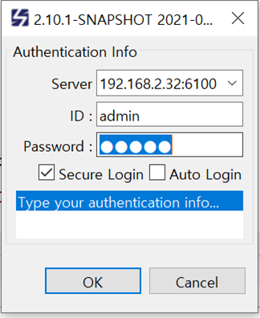

## **- CUBIRID agent 연결 상태 확인**

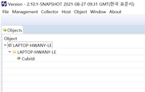

CUBRID agent가 서버에 연결되면 위 그림과 같이 Objects View에 객체가 추가된다.
CUBRID agent 연결은 agent가 실행되는 HostName과 그 하위에서 확인한다.

## **- CUBRID Perspective 추가**

Perspective를 추가하여 CUBRID 정보를 확인할 수 있다.


* 초기 화면

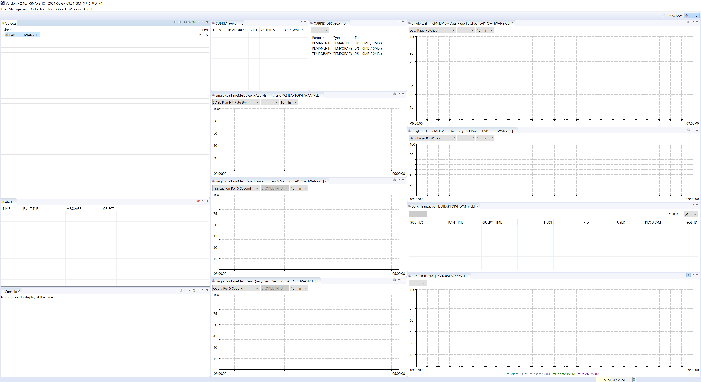


## **- View 추가**

* ObjectView에서 Cubrid Object를 선택한 후 컨텍스트 메뉴와 메인메뉴(Object)를 통해
초기 Perspective에 더 많은 View를 추가할 수 있습니다.

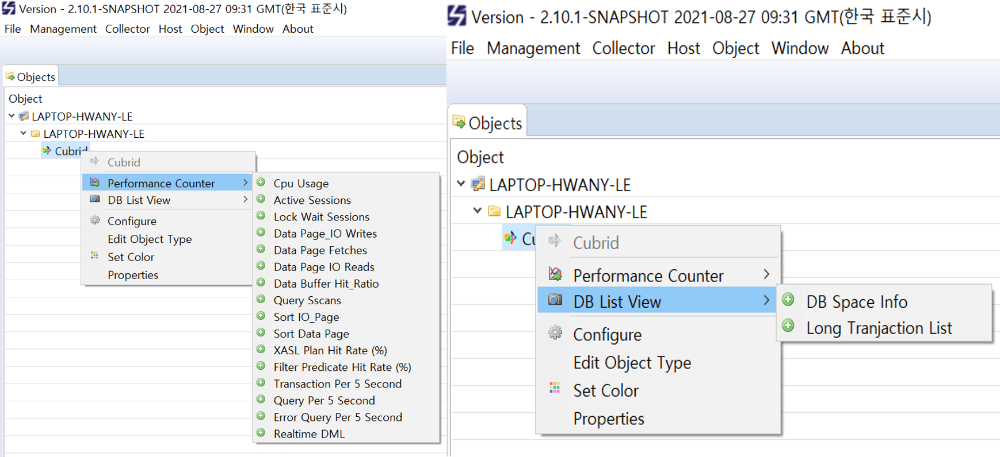
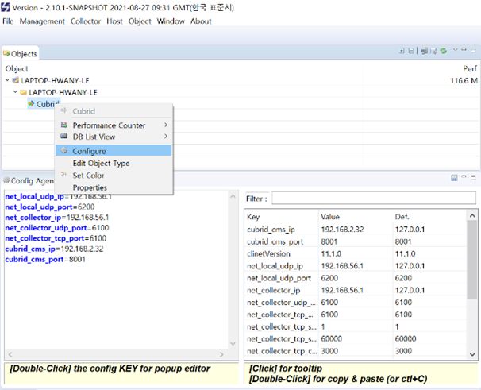
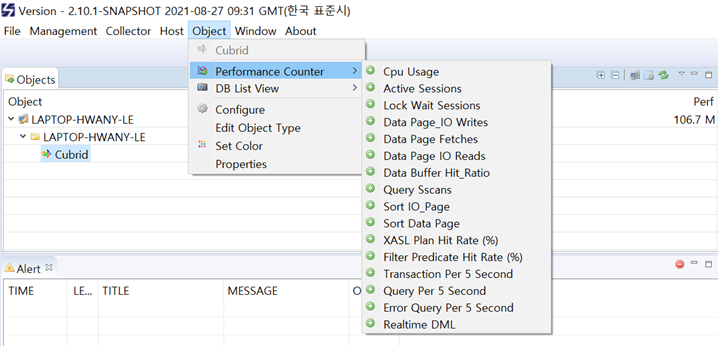


* 각 View에서는 컨텍스트 메뉴를 통해 선택이 고정되어 있는 DB와 모니터링 항목이 있는 View가 추가됩니다.
* DB, 모니터링 항목에 선택은 고정되어 재기동해도 유지 됩니다.


## **- View 정보**

### **1) Server Info**

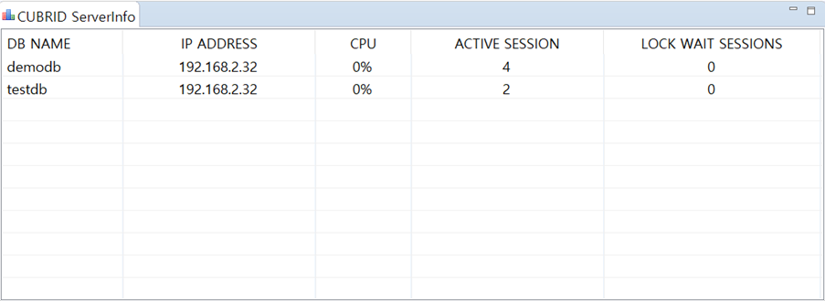

CMS(CUBRID Manager Server 이하 CMS)에 연결된 CUBRID DB 정보, DB 내 CPU 사용량, ACTIVE SESSION,
LOCK WAIT SESSIONS 정보가 표시되며 View는 닫을 수 없으며 최소화만 할 수 있습니다.

```
* CPU(%) : DB에 CPU 사용량. 
* ACTIVE SESSION : 
각 DB에 연결된 Active TranList의 합계. (gettransactioninfo)
* LOCK WAIT SESSIONS : 각 DB에서 wait_for_lock_holder가 (-1)이 아닌 TranList의 합계. (gettransactioninfo)
```

### **2) SingleRealTimeMultiView**

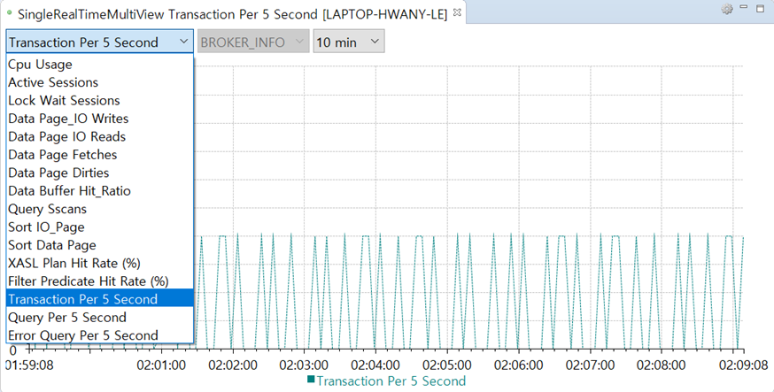

DB 정보와 브로커 정보 중 하나의 항목을 그래프로 표시하는 View이다.

#### **Single item list**

1. ServerInfo 정보와 동일한 정보

```
  * Cpu Usage : DB에 CPU 사용량.
  * Active Sessions : Active TranList의 합계.  
  * Lock Wait Sessions : 각 DB에서 wait_for_lock_holder가 (-1)이 아닌 TranList의 합계.
```

2. StatDump 정보 목록 (CUBRID statdump util을 통해 확인할 수 있는 숫자 값)
```
Data Page IO Writes
Data Page IO Reads
Data Page Fetches
Data Page Dirties
Data Buffer Hit Ratio
Query Sscans
Sort IO Page
Sort Data Page
```

3. plandump 정보(CUBRID plandump util을 통해)
```
XASL Plan Hit Rate (%) : plandump에 XASL 캐시에서 Lookups value를 Hits value으로 나눈다.
Filter Predicate Hit Rate (%) : plandump Filter Predicate Cache 에서 Lookups value를 EntryHists value 나눈다.
```

4. 브로커 정보에 리스트
```
Transaction Per 5 Second : 브로커 상태 정보의 TPS를  5초 동안의 누적한 데이터.
Query Per 5 Second : 브로커 상태 정보의 QPS를  5초 동안의 누적한 데이터.
Error Query Per 5 Second : 브로커 상태 정보의 Error 질의를 5초 동안의 누적한 데이터.

```

#### **SingleRealTimeMultiView의 컨텍스트 메뉴를 통해 실시간 및 과거데이터 보기**


실시간 view 및 과거 view를 추가하여 실시간 데이터 또는 과거 데이터를 확인할 수 있습니다.

1. 실시간을 위한 Viewer : 
CMS(CUBRID Manager Server)에서 5초마다 보낸 실시간 정보.

[view를 추가하기 위한 팝업]

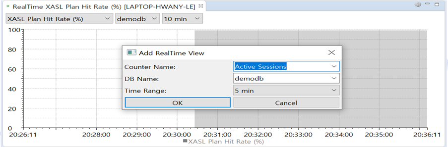


[결과]

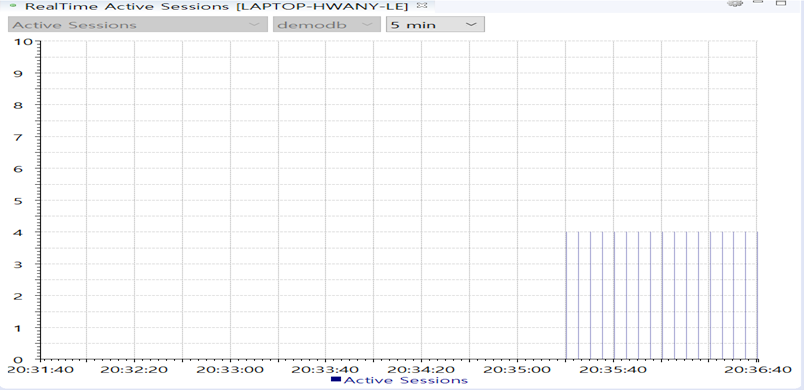

2. 과거을 위한 Viewer – 하루미만 :하루 미만으로 설정하고 실시간 정보 표시 기간 데이터를 그래프로 표시한다.

[view를 추가하기 위한 팝업]

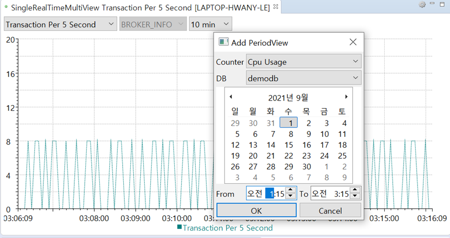


[결과]

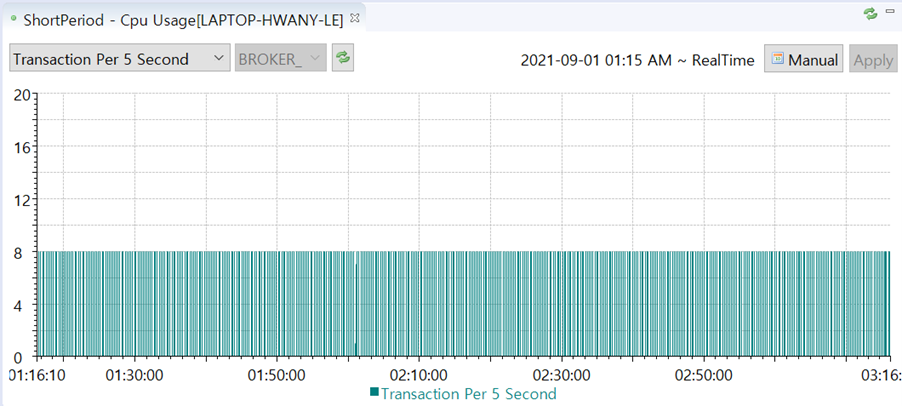

3.과거을 위한 Viewer – 하루 이상 : 
하루 이상으로 설정하고 실시간 정보를 누적하여 기간 데이터를 그래프로 표시한다.

[view를 추가하기 위한 팝업]

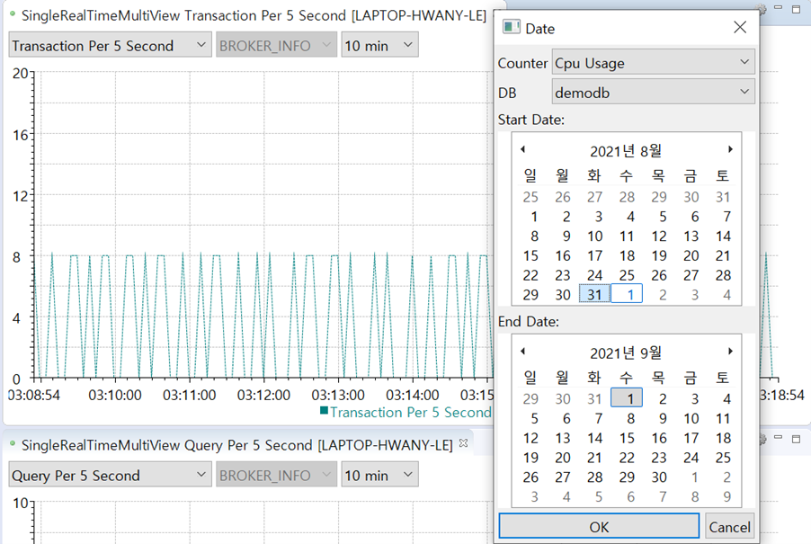


[결과]

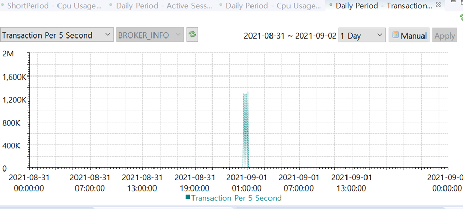


### **3) DB Space Info**
DB별 볼륨 용량 정보를 보여주는 View.

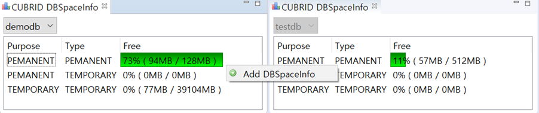

### **4) Long Transaction List**

3초 이상 시간이 초과된 트랜잭션 정보는 View에 생성되어 업데이트됩니다.
동일한 SQL 텍스트라도 호스트, pid, 사용자, 프로그램이 다르면 다른 트랜잭션입니다.
MaxList는 변경이 가능하며 10부터 1000까지 데이터를 확인할 수 있습니다.

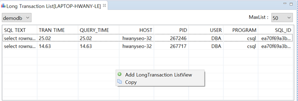