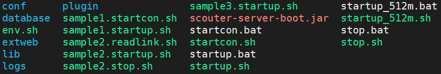
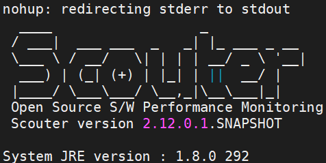
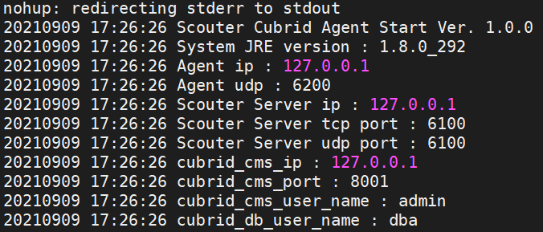
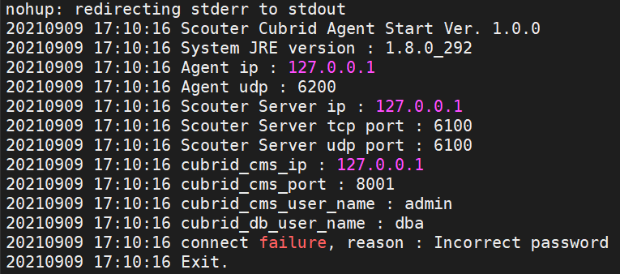
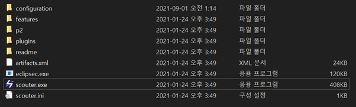
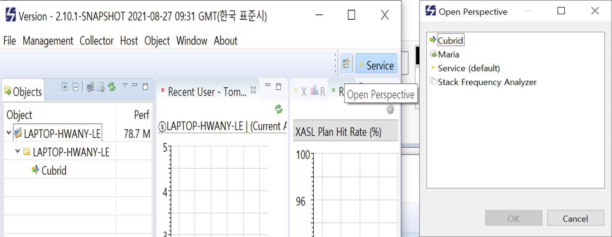

[](quick_start.md) [](quick_start_KR.md)
# 간단한 설치 설명서
Scouter Server, Client, Agent를 설치하고 환경 설정을 완료하면 Scouter를 통해 CUBRID를 모니터링 할 수 있습니다.

설치 방법과 설정에 대한 간단한 설명은 아래와 같습니다.

---
## Souter Server 

#### 1. 파일 받기. 
- Scouter Version 2.15.0 이상
- https://github.com/scouter-project/scouter/releases/tag/v2.15.0

#### 2. 2. 받은 파일 압축 해제
<p>원하는 디렉토리에 압축을 해제하세요.</p>


#### 3. Scouter server(Collector)를 실행 합니다.
- Linux
```
startup.sh
```
- Windows
```
startup.bat
```

- 실행 결과


#### 자세한 설정 가이드는 Setup.md 또는 Scouter에서 제공하는 문서를 참조하십시오.
https://github.com/scouter-project/scouter/blob/master/scouter.document/main/Setup.md

---
## Scouter-Cubrid-Agent
#### 1. 파일 받기. 
- https://github.com/scouter-contrib/scouter-agent-cubrid/releases

#### 2. 받은 파일 압축 해제.
<p>원하는 디렉토리에 압축을 해제하세요.</p>


#### 3. 연결 설정
- /conf/scouter_cubrid.conf
```
net_local_udp_ip=127.0.0.1  # Agent IP
net_local_udp_port=6200     # Agent UDP
net_collector_ip=127.0.0.1  # SCOUTER Server IP
net_collector_udp_port=6100 # SCOUTER Server UDP Port
net_collector_tcp_port=6100 # SCOUTER Server UDP Port
cubrid_cms_ip=127.0.0.1     # Cubrid Manager Server IP
cubrid_cms_port=8001        # Cubrid Manager Server Port
```
#### 4. CUBRID agent 실행
- Linux
```
startup.sh [cms_user_id] [cms_user_password] [dba_user_id] [dba_user_password]
```
- Windows
```
startup.bat [cms_user_id] [cms_user_password] [dba_user_id] [dba_user_password]
```

- 실행 결과

(성공)



(실패)



#### 5. CUBRID agent 중지하기.
- Linux
```
stop.sh
```
- Windows
```
stop.bat
```

---

## Scouter Client

#### 1. 파일 받기
- https://github.com/scouter-project/scouter/releases

#### 2. 받은 파일 압축 해제.
<p>원하는 디렉토리에 압축을 해제하세요..</p>


#### 3. scouter client 실행
스카우터 클라이언트 실행 파일(scouter.exe)을 클릭하여 실행합니다.
로그인 화면에서 수집 서버는 [server_ip]:[server_port]로, 기본 아이디/비밀번호는 admin/admin으로 로그인할 수 있습니다.


#### 4. CUBRID Perspective 열기



---
